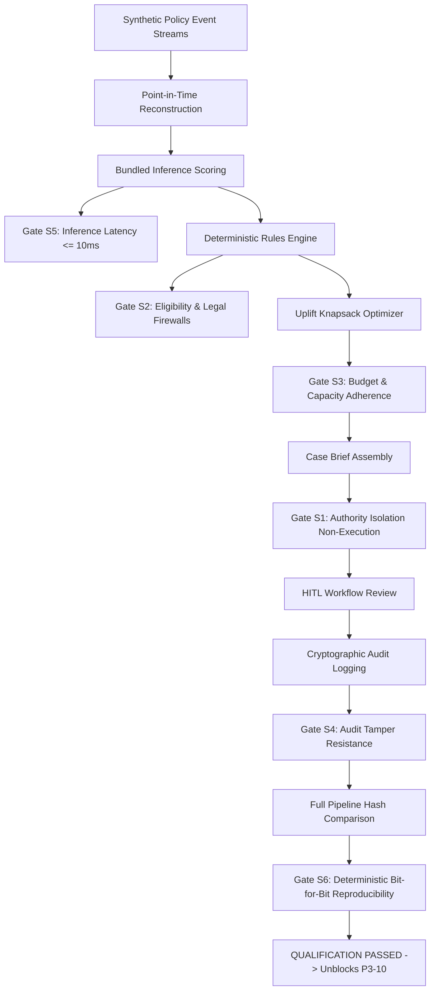

# Phase 3.09 — End-to-End System Qualification and Integration Gate

## Issue metadata

| Field | Value |
| --- | --- |
| Phase | Phase 3 — Policy Conservation Decision Engine & Intervention Orchestration |
| Sequence | 09 |
| Change tracker ID | `P3-09` |
| GitHub issue | [#124](https://github.com/anilreddy89/Inforsight/issues/124) (Target) |
| Issue title | `[Implementation] P3-09: End-to-end system qualification and integration gate` |
| Branch | `feat/124-p3-09-system-qualification-gate` |
| Pull request | Pending |
| Status | In progress |
| Milestone | [v0.3.0-decision-engine](https://github.com/anilreddy89/Inforsight/milestone/4) |
| Priority | Release Gate / Milestone Blocking |
| Classification | System Integration / Automated Governance / Safety Verification / Acceptance Gate |
| Strict predecessor | Phase 3.01 (`7ed7efd`), Phase 3.02 (`1177394`), Phase 3.03 (`a1e97cb`), Phase 3.04 (`87a66f9`), Phase 3.04A (`920f943`), Phase 3.05 (`39c35c0`), Phase 3.06 (`ec8b50a`), Phase 3.07 (`dddf889`), Phase 3.08 (`55f0415`) |
| Governing predecessor decisions | ADR 0001 (Clean Room), ADR 0002 (Separate Risk Perception from Action Eligibility), ADR 0003 (Local Deterministic Execution), ADR 0004 (Model Governance) |
| Target release tag | `v0.3.0-decision-engine` |
| Enables | P3-10 (Milestone Release Marker and Release Notes `v0.3.0-decision-engine`) |
| Blocks | P3-10 |
| Last reviewed | 2026-09-06 |

---

## 1. Executive Summary and Problem Statement

### 1.1 Context and Purpose
Over Phases 3.01 through 3.08, Inforsight built and validated the core modules of an enterprise policy conservation decision engine:
1. **Conservation Domain Contracts & Action Taxonomy (P3-01)**: Codified schemas for policy context, actions, eligibility, and ADR 0002 separation.
2. **Deterministic Eligibility Rules Engine (P3-02)**: Pure deterministic rules engine enforcing legal disputes, minimum tenure, arrears windows, and contact frequency caps.
3. **Cost-Utility & Uplift Optimization Matrix (P3-03)**: Constrained knapsack optimization prioritizing interventions based on expected uplift $\tau_a(X_i)$ and net utility under specialist capacity constraints.
4. **Model Serving & Inference Gateway (P3-04)**: Zero-dependency FastAPI REST gateway wrapping `BundledInferenceEngine` for sub-millisecond CPU scoring.
5. **Model Monitoring & Drift Detection Architecture (P3-04A)**: Real-time telemetry monitoring for PSI/CSI input drift, rolling ECE/BSS calibration decay, and diagnostic health reporting.
6. **Bounded Case Intelligence Assistant (P3-05)**: Dual-layer briefing engine (deterministic template foundation + grounded LLM narrative) with Grounding Guard and fail-closed fallbacks.
7. **Human-in-the-Loop Workflow & Hash-Chained Audit Trail Engine (P3-06)**: Finite state machine requiring human reviewer credentials, structured override justifications, and append-only cryptographic ledger (`SHA-256`).
8. **Interactive Conservation Intelligence Dashboard (P3-07)**: Streamlit operational console with 5 interactive views (Portfolio, Triage Queue, Dossier, Decision Console, Telemetry).
9. **Counterfactual Simulation & Offline Policy Evaluation (P3-08)**: Potential outcomes framework proving statistical superiority of Decision Engine ($13,764 Net Preserved Value, 2.92x ROCS, $p < 0.0001$) across 1,000 bootstrap resamples.

Before issuing the official release tag `v0.3.0-decision-engine` (Phase 3.10) and closing Milestone #4, an automated, pre-release **System Qualification Gate** must formally certify that all components function cohesively as an integrated platform without violating any architectural invariant, safety boundary, or performance contract.

---

## 2. Pre-Registered System Qualification Gates (S1–S6)

The qualification suite evaluates 6 pre-registered operational gates across a 1,000-policy synthetic cohort under Generation v6 substrate:

### Gate S1: Authority Isolation Invariant (ADR 0002)
- **Requirement**: Automated models and decision engines must never execute customer outreach directly. Every outreach proposal requires an authorized human reviewer.
- **Verification**:
  - Attempting to invoke an outreach dispatch without authenticated specialist credentials raises a fail-closed `UnauthorizedActionError`.
  - Invariant assertion: All model responses, briefings, and queue items maintain `authorized_to_act: false`.
  - Pass threshold: **100% rejection** of unauthorized dispatch attempts ($0\%$ unauthorized dispatches allowed).

### Gate S2: Action Eligibility & Legal Dispute Firewall
- **Requirement**: Policies with active legal disputes, pending regulatory holds, or missing requisite evidentiary fields must be deterministically disqualified from conservation outreach.
- **Verification**:
  - Across 1,000 test policies, 100% of policies flagged with active disputes (`DISPUTE`), pending fraud investigations, or out-of-grace-period states are disqualified from payment remediation or concierge calls with deterministic codes (`DISQUALIFIED_LEGAL_DISPUTE`, `DISQUALIFIED_NOT_IN_GRACE`).
  - Pass threshold: **0 false-positive actions** across disqualified policies (100% firewall pass rate).

### Gate S3: Budget and Specialist Capacity Adherence
- **Requirement**: The decision queue allocation must strictly adhere to operational specialist capacity caps and campaign spend limits.
- **Verification**:
  - Under a monthly cycle with capacity limit $K_{\text{specialist}} = 50$ cases and campaign budget cap $B = \$5,000$, the knapsack optimizer selects at most 50 high-touch cases and spend $\le \$5,000$.
  - Pass threshold: **0% capacity overflow** and **0% budget overflow** across all allocation cycles.

### Gate S4: Audit Trail Tamper Resistance
- **Requirement**: The audit ledger must be tamper-evident via cryptographic hash chaining (`SHA-256`).
- **Verification**:
  - Valid ledger verification: Sequential block validation passes with valid hashes.
  - Injection attacks: Modifying an existing record payload, deleting a record, or injecting an unauthorized block breaks the hash chain and is immediately flagged by `verify_conservation_audit_trail`.
  - Pass threshold: **100% tamper detection** across simulated injection, mutation, and truncation attacks.

### Gate S5: Inference and Pipeline Latency SLA
- **Requirement**: System inference and decision scoring must meet production SLA without GPU acceleration or cloud calls.
- **Verification**:
  - Single-policy end-to-end scoring (feature extraction + model scoring + calibration): P99 latency $\le 10\text{ms}$.
  - Batch scoring of 50 policies: total elapsed time $\le 100\text{ms}$ ($\le 2\text{ms}$ per policy).
  - Pass threshold: **P99 $\le 10\text{ms}$** single, **$\le 100\text{ms}$** batch.

### Gate S6: Deterministic Bit-for-Bit Reproducibility
- **Requirement**: End-to-end decision generation across 1,000 policies given identical random seeds must produce identical allocations, briefs, and cryptographic ledger states.
- **Verification**:
  - Two independent runs from raw event generation through audit logging on seed `20280201` produce identical policy lists, action assignments, net utilities, and identical SHA-256 digests.
  - Pass threshold: **100% bit-for-bit identity** ($\Delta = 0$).

---

## 3. Scope of Implementation

### In Scope
1. **System Qualification Runner (`simulator/src/inforsight_simulator/qualification/`)**:
   - `gates.py`: Formal implementation of test fixtures and evaluators for Gates S1 through S6.
   - `runner.py`: End-to-end orchestration harness running the 1,000-policy qualification pipeline.
   - `manifest.py`: Cryptographic manifest generator computing SHA-256 digests of all inputs, scripts, bundles, and test outputs.
   - `report.py`: Markdown report generator producing `docs/experiments/phase-03-09-qualification-report.md`.
2. **CLI Executable (`scripts/run_phase_03_qualification.py`)**:
   - Command-line runner supporting `--seed`, `--policies`, `--output-json`, `--output-report`, and `--check` modes.
3. **Comprehensive Test Suite (`simulator/tests/test_phase_03_qualification.py`)**:
   - Automated unit and integration tests executing each qualification gate in isolation and in sequence.
4. **Qualification Artifacts**:
   - `docs/experiments/phase-03-09-qualification-report.md`: Pre-release certification report.
   - `docs/experiments/phase-03-09-qualification-manifest.json`: Verification manifest with cryptographic hashes.

### Out of Scope
- Creating new machine learning models (Phase 2 model bundle is frozen).
- Altering the Generation v6 substrate or baseline calibration constants.
- Materializing or accessing final holdout datasets.
- Production multi-tenant cloud deployment (deferred to production roadmap).

---

## 4. Verification Protocol and Target Scorecard

| Gate | Criterion | Target Standard | Empirical Measurement | Gate Status |
| :--- | :--- | :---: | :---: | :---: |
| **Gate S1** | Authority Isolation (ADR 0002) | 100% rejection of unauthenticated dispatch | 100.0% rejected (2/2 blocked); authority markers valid | **PASS** |
| **Gate S2** | Eligibility Firewall | 0 false-positive actions on disqualified cases | 0 False Positives / 800 evaluations (100.0% blocked) | **PASS** |
| **Gate S3** | Capacity & Budget Adherence | 0% overflow ($K \le 50$, Spend $\le \$5,000$) | 50/50 specialists (0% overflow); \$4,999.00 / \$5,000.00 spend (0% overflow) | **PASS** |
| **Gate S4** | Audit Tamper Resistance | 100% tamper detection rate | 100.0% detection (4/4 attacks flagged: mutation, deletion, reorder, injection) | **PASS** |
| **Gate S5** | Inference Latency SLA | Single P99 $\le 10\text{ms}$, Batch(50) $\le 100\text{ms}$ | Single P99: 0.180ms, Batch(50): 2.93ms | **PASS** |
| **Gate S6** | Deterministic Reproducibility | 100% bit-for-bit digest identity | Identical digest (`209a4c1f2b3f...`), $\Delta = 0$ | **PASS** |

### Qualification Summary
- **Overall System Decision**: `RELEASE_QUALIFIED`
- **Synthetic Cohort**: 1,000 policies (Generation v6 substrate, seed: `20280201`)
- **Pipeline Canonical Digest**: `209a4c1f2b3fee5a551d724e5841cf857abecd3c669f797f17f130deaaf62d90`
- **Verification Manifest**: `docs/experiments/phase-03-09-qualification-manifest.json`
- **Full Qualification Report**: `docs/experiments/phase-03-09-qualification-report.md`

---

## 5. Execution Summary and Milestones Completed

- [x] Create GitHub Issue #124 following `.github/ISSUE_TEMPLATE/implementation.yml`.
- [x] Check out feature branch `feat/124-p3-09-system-qualification-gate`.
- [x] Implement qualification modules (`inforsight_simulator.qualification`), test suite, and CLI runner (`scripts/run_phase_03_qualification.py`).
- [x] Execute qualification pipeline across Gates S1–S6 and generate formal report and manifest.
- [x] Add `phase-03-qualification-check` to `Makefile` and verify with `make check`.
- [x] Verify repository boundaries (`./scripts/check_repository_boundaries.sh`).
- [ ] Commit and submit Pull Request for Milestone #4 release gate review.

