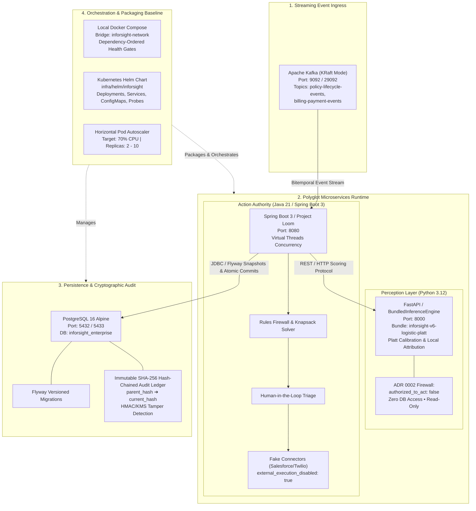

# Phase 4.06 — Cloud Infrastructure, Helm, and Container Orchestration

P4-06 packages the bounded Phase 4 services into reproducible local and
Kubernetes-oriented deployment artifacts. It adds multi-stage container
definitions, a health-checked Docker Compose topology, and a Helm chart with
resource, probe, configuration, and autoscaling boundaries. The phase proves
renderable deployment configuration and local orchestration behavior; it does
not claim production cloud readiness or live external execution.

| Field | Value |
| --- | --- |
| Phase | Phase 4 — Enterprise Integration & Scale |
| Milestone | `v0.4.0-enterprise-scale` (Milestone #5) |
| Status | In progress |
| Depends on | P4-04, P4-05, ADR 0002 human authority boundary |
| Blocks | P4-07 |
| Tracking issue | [#192](https://github.com/anilreddy89/Inforsight/issues/192) |
| Pull request | TBD |
| Branch | `implementation/p4-06-cloud-infrastructure-helm-orchestration` |

## Architecture Overview & Visual Poster

### Polyglot System Topology

### Component Deployment Specifications

- **Streaming Gateway: Apache Kafka (KRaft Mode)**:
  - Container Image: `confluentinc/cp-kafka:7.6.0`
  - Consensus: KRaft mode (zero ZooKeeper dependency).
  - Ports: `9092` (host) / `29092` (container bridge network `inforsight-network`).
  - Topics: `policy-lifecycle-events`, `billing-payment-events`, `customer-service-events`.
  - Health check: `kafka-broker-api-versions --bootstrap-server localhost:9092`.

- **Inference Runtime (Python 3.12 / FastAPI)**:
  - Dockerfile: `infra/docker/Dockerfile.inference` (multi-stage non-root build as `inforsight`).
  - Bundle: Frozen `inforsight-v6-logistic-platt-20260817` with Platt calibration and local attributions.
  - Port: `8000`.
  - Health check: `GET /health`.
  - ADR 0002 Invariant: **Perception Authority Only** (`authorized_to_act: false`). Zero database access.

- **Control Plane (Java 21 / Spring Boot 3)**:
  - Dockerfile: `infra/docker/Dockerfile.control-plane` (Maven builder $\to$ Eclipse Temurin 21 JRE, non-root `inforsight:inforsight`).
  - Concurrency: Java 21 Virtual Threads (Project Loom) with Spring profile `persistence`.
  - Port: `8080`.
  - Health check: `GET /actuator/health`.
  - ADR 0002 Invariant: **Sole Action Authority**. Deterministic rules firewall, knapsack uplift optimizer, and human caseworker approval. Fake-only CRM connectors (`external_execution_disabled: true`).

- **Persistence & Cryptographic Audit Store (PostgreSQL 16 Alpine)**:
  - Container Image: `postgres:16-alpine`.
  - Port: `5432` (host mapping `5433`).
  - Migrations: Flyway schema migrations (`policy_snapshot`, `active_triage_queue`, `case_state`).
  - Audit Ledger: Append-only `conservation_audit_ledger` with SHA-256 hash chaining (`parent_hash` $\to$ `current_hash`) and tamper detection.
  - Health check: `pg_isready -U inforsight_app -d inforsight_enterprise`.

- **Kubernetes Helm Chart (`infra/helm/inforsight`)**:
  - Declarative manifests for `Deployments`, `ClusterIP Services`, `ConfigMaps`, and liveness/readiness probes.
  - Resource boundaries: 500m CPU / 512Mi RAM request for application pods.
  - Horizontal Pod Autoscaler (`autoscaling/v2`): Target 70% CPU utilization, 2–10 replicas.

---

## Objective

Define a coherent, reproducible deployment baseline for the Java control plane,
inference-only runtime, Kafka ingress, and PostgreSQL-backed local workflow.
The baseline must preserve the existing point-in-time, audit, human-review,
and `authorized_to_act: false` boundaries at every deployment surface.

## Scope

- Add multi-stage, non-root Docker build definitions for the Java control plane
  and inference-only runtime, with deterministic configuration and bounded
  health endpoints.
- Add a local Docker Compose topology for the bounded services and PostgreSQL,
  with explicit networks, health checks, dependency ordering, and documented
  startup/teardown behavior.
- Add `infra/helm/inforsight` templates for Deployments, Services,
  configuration references, probes, resource requests/limits, and HPA.
- Keep connector execution disabled by default and preserve
  `authorized_to_act: false` and `external_execution_disabled: true` markers.
- Add focused manifest/configuration validation and `make p4-06-check`.
- Update the phase record, backlog, tracker, roadmap UI, README, and limitation
  language with evidence and explicit claim boundaries.

## Explicit non-goals

- No production cloud account, Kubernetes cluster, registry, ingress
  certificate, or live deployment.
- No credentials, OAuth, identity federation, KMS, secrets custody, or
  customer/production data.
- No live Salesforce, Genesys, Twilio, CRM, telephony, Kafka, or autonomous
  external action beyond local bounded harnesses.
- No production PostgreSQL HA, managed Kafka, disaster recovery, SLO, CVE
  certification, or distributed performance claim.
- No P4-07 100,000-policy qualification or `v0.4.0` release marker.
- No changes to protected generated artifacts, historical qualification
  artifacts, model bundles, or final-holdout data.

## Acceptance checks

- [x] Multi-stage Docker builds exist for the Java control plane and
  inference-only runtime, using runtime-safe non-root defaults.
- [x] Docker Compose renders and starts the bounded local topology with
  PostgreSQL, health checks, explicit ports, and no live connector transport.
- [x] Helm templates render successfully and define Deployments, Services,
  probes, resources, configuration boundaries, and HPA behavior.
- [x] Default deployment configuration preserves
  `authorized_to_act: false` and `external_execution_disabled: true`.
- [x] Focused checks, `make p4-06-check`, and the full local `make check` pass;
  required PR CI checks remain as final acceptance work.
- [x] Documentation and limitation statements distinguish local deployment
  evidence from production readiness.

## Evidence plan

- Dockerfile build or documented Docker-unavailable fallback evidence.
- `docker compose config` and local health-check output where Docker is
  available.
- `helm lint`/`helm template` or equivalent rendered-manifest validation.
- Focused tests, `make p4-06-check`, `make check`, `git diff --check`, and PR
  CI results.
- Closeout evidence naming the exact deployment behavior proven and the
  production claims that remain deferred.

## Implementation evidence

- `make p4-06-check` passes with dependency-free structural checks.
- Full `make check` passes: 546 tests passed, with one optional Kafka
  integration test skipped because `INFORSIGHT_RUN_KAFKA_INTEGRATION=1` was not
  enabled.
- `docker compose -f infra/docker-compose.yml config --quiet` passes.
- `helm lint infra/helm/inforsight` and `helm template` pass; the chart renders
  control-plane/inference/PostgreSQL Services and Deployments, probes, resource
  limits, configuration boundaries, and a CPU HPA.
- Docker Desktop built `inforsight-inference:p4-06` and
  `inforsight-control-plane:p4-06` successfully. The Compose smoke test reached
  healthy inference, PostgreSQL, Kafka, and control-plane services; inference
  `/health` returned the expected trusted bundle identity and control-plane
  `/actuator/health` returned `UP`.
- The smoke-test stack was removed after verification. Existing unrelated local
  containers were not changed.
- This evidence proves local reproducible packaging and health wiring only; it
  does not prove cloud deployment, CVE absence, production HA, SLOs, or scale.

## Evidence Boundary Matrix

| Dimension | Proven in P4-06 (Local Baseline) | Explicitly Deferred / Out of Scope |
| :--- | :--- | :--- |
| **Containerization** | Non-root multi-stage Docker builds pass cleanly for Python & Java | No public registry push, cloud vulnerability scanning, or CVE certification |
| **Local Orchestration** | Docker Compose starts Kafka, Postgres, Inference, Control Plane with health gates | Not a production HA topology, managed cloud database, or disaster recovery claim |
| **Kubernetes Packaging** | Helm templates render Deployments, Services, ConfigMaps, Probes, and HPA | No live production Kubernetes cluster, ingress certificates, or cloud DNS |
| **External Connectors** | Enforced `authorized_to_act: false` and fake-only connector preflight | No live Salesforce FSC, Genesys, Twilio, or outbound telephony/SMS execution |
| **Scale Qualification** | HPA specification defined with CPU 70% threshold (2–10 replicas) | 100,000-policy distributed stress test and E1–E6 gates owned by P4-07 |

## Issue workflow

Implementation issue [#192](https://github.com/anilreddy89/Inforsight/issues/192)
uses the repository implementation template with backlog work ID `P4-06`,
classification `New capability / deployment boundary`, priority `Milestone
blocking`, and milestone `v0.4.0-enterprise-scale`. It identifies P4-04 PR
#189 and P4-05 PR #191 as merged prerequisites and keeps production deployment,
credentials, and external execution out of scope.

## Initial design decisions

- Local Compose is an evidence harness, not a production topology claim.
- Helm values expose deployment settings explicitly; no secret values are
  committed and external connector execution remains disabled by default.
- HPA configuration is a renderable policy boundary only until P4-07 supplies
  a separately reviewed scale qualification.
- Image and manifest version changes must be explicit and must not rewrite
  protected model or historical evidence artifacts.

## Closeout evidence

To be completed after implementation: PR number, merge commit, focused Docker
and Helm evidence, required CI results, and the final local-only deployment
limitation statement.
