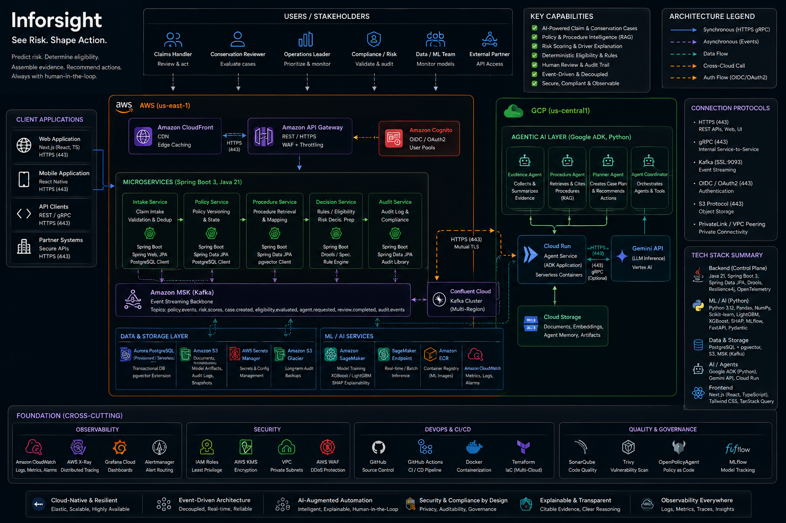

<p align="center">
  
</p>

<p align="center">
  <a href="LICENSE"></a>
</p>

Inforsight is a clean-room project for conservation case intelligence on in-force life-insurance policies. It reconstructs fictional policy timelines, estimates near-term lapse or surrender risk, applies deterministic eligibility rules, assembles cited evidence, and keeps a human reviewer in control of every intervention.

## First falsifiable claim

Can we generate a realistic fictional in-force policy timeline and predict which active policies are likely to lapse within 90 days without leaking future information?

The first milestone is deliberately smaller than the complete architecture: generate reproducible fictional policy-event histories, reconstruct state as of a chosen date, and validate that model features contain no future information.

## What Inforsight is

- A policy-lifecycle and conservation decision-support demonstration.
- A clean-room system built from fictional data, fictional procedures, public references, and original code.
- A separation of probabilistic risk estimation, deterministic action eligibility, bounded assistance, human approval, and audit replay.
- A staged engineering project whose assumptions, experiments, limitations, and rejected approaches remain visible.

## What Inforsight is not

- An underwriting or new-business risk classifier.
- A generic churn dashboard.
- An autonomous system that contacts customers or executes financial actions.
- A claim of production accuracy based on synthetic data.
- A reproduction of an insurer's proprietary data, rules, workflows, terminology, or software.

## Authority model

| Layer | Responsibility | Hard boundary |
| --- | --- | --- |
| Predictive model | Estimate time-bounded lapse or surrender risk | Cannot select or execute an action |
| Deterministic rules | Decide which actions are allowed | Cannot fabricate facts or override required evidence |
| Bounded assistants | Assemble evidence and draft recommendations | Cannot bypass rules or human review |
| Human reviewer | Approve, reject, or request more information | All interventions require an accountable decision |
| Audit trail | Preserve inputs, versions, recommendations, and decisions | Must support point-in-time replay |

## Target architecture



This diagram shows the intended long-term system boundary and technology direction. It is not a representation of the current Phase 0 implementation; components will be introduced incrementally only after their assumptions and interfaces are validated.

## Repository map

```text
data-contracts/   Versioned fictional data schemas
simulator/        Seeded policy and event generator (first implementation target)
ml/               Leakage-safe features, experiments, evaluation, and model cards
services/         Java control-plane services and deterministic rules
agents/           Bounded evidence, procedure, and planning assistants
infra/            Local and cloud infrastructure added only when justified
docs/             Assumptions, ADRs, experiments, and published documentation assets
scripts/          Repository validation and developer utilities
```

## Current status

Phase 1 - Policy Digital Twin is complete. The versioned event contracts, deterministic 100-policy generator, point-in-time reconstruction, cross-event history validation, and reproducible eight-policy fictional [sample dataset](datasets/sample-policy-events.jsonl) are implemented. The aggregate [synthetic-rate assessment](docs/experiments/phase-01-07-synthetic-rate-assessment.md) retains the equal scenario mix as a coverage fixture rather than a prevalence estimate.

Phase 2.01 defines the versioned [modeling and observation contract](docs/modeling/phase-02-01-modeling-contract.md), dual effective-and-ingestion-time feature visibility, active-policy eligibility, explicit 90-day lapse-or-surrender labels, and right-censoring. The deterministic [data-sufficiency gate](docs/experiments/phase-02-01-observation-sufficiency.json) permits a narrow baseline engineering experiment with prominent synthetic-data limitations.

Phase 2.03 is complete with a versioned [policy-aware temporal split contract](docs/modeling/phase-02-03-temporal-split-contract.md) and deterministic [split manifest](docs/experiments/phase-02-03-temporal-split-manifest.json) ([issue #20](https://github.com/anilreddy89/Inforsight/issues/20), [PR #21](https://github.com/anilreddy89/Inforsight/pull/21)). The strict 90-day embargo and isolation checks support pipeline engineering only: first-billing timing separates billing-frequency categories across the canonical train, validation, and test partitions, so the synthetic split does not establish temporal generalization.

Phase 2.04 provides a deterministic [feature pipeline](docs/modeling/phase-02-04-feature-pipeline-contract.md) with training-only preprocessing. Phase 2.05 adds a seeded [logistic-regression baseline](docs/modeling/phase-02-05-logistic-baseline-contract.md). Phase 2.06 completes one frozen XGBoost candidate and a reproducible [comparison report](docs/experiments/phase-02-06-boosted-comparison-report.md) on identical train and validation observations ([issue #26](https://github.com/anilreddy89/Inforsight/issues/26), [PR #27](https://github.com/anilreddy89/Inforsight/pull/27)). Phase 2.07 adds leakage-aware feature sanity and shortcut diagnostics ([issue #28](https://github.com/anilreddy89/Inforsight/issues/28), [PR #29](https://github.com/anilreddy89/Inforsight/pull/29)). These v1 results remain historical `pipeline_engineering_only` evidence.

An independent review after Phase 2.07 identified three claim-blocking concerns: billing frequency is confounded with observation time (`LIM-002-001`), v1 has no designed pre-cutoff feature-to-outcome risk mechanism (`LIM-002-002`), and the test-scoring guard can be bypassed by relabeling a matrix (`LIM-002-003`). Logistic and boosted predictions were generated from the v1 test fixture during that adversarial check, although no test metric was computed and no repository artifact changed. The fixture is therefore review-exposed historical evidence, not an untouched release holdout.

[Phase 2R](docs/backlog.md#phase-2r---modeling-foundation-remediation-gate) is the active remediation gate inside the [**v0.2.0-risk-model**](https://github.com/anilreddy89/Inforsight/milestone/3) milestone. R2-00 through R2-13 are merged; R2-08 [issue #53](https://github.com/anilreddy89/Inforsight/issues/53) remains the historical v3 design anchor. R2-11 [issue #64](https://github.com/anilreddy89/Inforsight/issues/64) and [PR #65](https://github.com/anilreddy89/Inforsight/pull/65), merge `76c8cd3`, record the historical v3 `redesign`. R2-13 [PR #70](https://github.com/anilreddy89/Inforsight/pull/70), merge `7c4a1a7`, freezes v4 substrate `4.0.0`. R2-14 [issue #72](https://github.com/anilreddy89/Inforsight/issues/72) is implemented locally across all 20 development seeds and mechanically decides `redesign`: observable recovery, probability quality, reference recovery, and hazard validity fail. R2-15 and future acceptance remain blocked. The final holdout remains `not_materialized`, P2-08/P2-09 remain paused, and downstream performance-dependent work remains blocked.

See [the initial backlog](docs/backlog.md), [domain assumptions](docs/assumptions.md), [limitation register](docs/limitations.md), and [clean-room policy](docs/clean-room-policy.md) before contributing.

## Getting started

The current repository requires Python 3.11 or newer, GNU Make, Git, and the pinned simulator dependency `scikit-learn==1.7.2`.

```bash
git clone https://github.com/anilreddy89/Inforsight.git
cd Inforsight
make check
```

The check runs repository-boundary validation; all published artifact reproducibility checks through Phase 2.07; focused leakage and model-pipeline tests; data-contract tests; and the complete simulator test suite.

[GitHub Actions](https://github.com/anilreddy89/Inforsight/actions/workflows/ci.yml) runs the same checks on every push and pull request.

See [CONTRIBUTING.md](CONTRIBUTING.md) before proposing changes. All contributions must follow the fictional-data and clean-room boundaries.

## License

Copyright 2026 Anil Kumar Reddy Jonnala. Licensed under the [Apache License 2.0](LICENSE). Third-party software remains subject to its own license terms.
