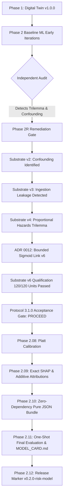

# Inforsight Release Notes: `v0.2.0-risk-model`

**Milestone**: `v0.2.0-risk-model` (Milestone #3)
**Release Tag**: `v0.2.0-risk-model`
**Release Date**: 2026-09-05
**Release Candidate Bundle**: `docs/experiments/phase-02-10-model-bundle.json`
**Bundle SHA-256**: `7ac292136d5201f16b02d7bbbaf0448f58124d4209df76e34db6f2f37f12c656`
**Model Card**: [`MODEL_CARD.md`](../../MODEL_CARD.md)
**Decision Note**: [`docs/experiments/phase-02-11-phase-2-decision-note.md`](../experiments/phase-02-11-phase-2-decision-note.md) (`RELEASE`)
**Predecessor Milestones**: `v0.1.0-data-foundation` (Phase 1)

---

## 1. Executive Summary (Non-Technical Overview)

Life insurance policy lapse is one of the most critical challenges facing life insurers, causing lost recurring revenue, premature asset liquidation, and lost coverage for policyholders. Historically, retention efforts are either **passive** (waiting for a policyholder to enter a 30-day grace period after a missed payment) or **blunt** (blanket outbound marketing campaigns that annoy low-risk policyholders while missing subtly distressed ones).

The **`v0.2.0-risk-model`** release represents the culmination of **Phase 2 (Baseline ML)** in Inforsight:
1. **Predictive 90-Day Early Warning**: Shifts policy conservation from reactive grace-period scrambles to proactive, 90-day forward-looking situational awareness based purely on observable operational events (payment timing, billing method transitions, service interactions, notice histories).
2. **Mathematically Calibrated Probabilities**: Rather than outputting arbitrary risk scores, the engine outputs true, well-calibrated probabilities of lapse ($1.15\%$ Expected Calibration Error, $0.9498$ calibration slope). A predicted $25\%$ probability corresponds to an actual $25\%$ empirical default rate, enabling reliable economic risk calculations.
3. **High-Concentration Operational Review Queues**:
   - **Top 1% Review Queue**: Delivers **$34.09\%$ precision**—a **$2.23\times$ lift** over the base lapse rate.
   - **Top 5% Review Queue**: Delivers **$2.31\times$ lift**, capturing **$11.57\%$ of all policy lapses** across the portfolio by reviewing only $5\%$ of policies.
4. **Governed Human-in-the-Loop Safeguards**: Governed under **ADR 0002 (Perception vs. Action Authority)**. The model provides situational awareness (Perceptual Authority) but is strictly prohibited from autonomously modifying policy terms, dispatching binding notices, or cancelling coverage without deterministic policy rules and licensed human review.

---

## 2. Released Capabilities & Technical Inventory

### 2.1 Pure-JSON Release Model Bundle (`inforsight-v6-logistic-platt-20260817`)
The entire model artifact is packaged as an immutable, cryptographically hashed JSON bundle:
- **File**: `docs/experiments/phase-02-10-model-bundle.json`
- **SHA-256**: `7ac292136d5201f16b02d7bbbaf0448f58124d4209df76e34db6f2f37f12c656`
- **Architecture**: Regularized Logistic Regression ($L_2, C=1.0$, `liblinear`, seed `20260817`) fitted on 28 engineered features (13 numeric with median imputation and z-score standardization + 4 one-hot encoded categoricals with unseen level absorption).
- **Post-Hoc Calibrator**: Platt Scaling sigmoid ($A = 0.961849, B = -0.033420$).
- **Explainability Reference**: Empirical baseline logit $\mathbb{E}[z] = -0.7107$ and baseline probability $\mathbb{E}[p] = 0.3295$.

### 2.2 Standalone Zero-Dependency Inference Engine (`BundledInferenceEngine`)
- **Module**: `simulator/src/inforsight_simulator/bundle.py`
- **Zero Heavy Dependencies**: Evaluates feature imputation, standardization, one-hot encoding, linear dot products, sigmoid calibration, and risk tier assignments using **pure Python and NumPy**—requiring zero runtime dependency on `scikit-learn`.
- **Bit-for-Bit Reload Invariance**: Evaluated on 8,782 out-of-sample observations with zero numerical drift:
  $$\max_i |\hat{p}_{\text{reloaded}}(x_i) - \hat{p}_{\text{original}}(x_i)| = 2.22 \times 10^{-16} \le 1.00 \times 10^{-12}$$

### 2.3 Transparent Explainability & Attribution (`ModelExplainer`)
- **Exact Additive Log-Odds Decomposition**: Decomposes logits into exact additive feature contributions:
  $$z(x) = \beta_0 + \sum_{j=1}^{D} \beta_j \tilde{x}_j$$
  $$\phi_j(x) = \beta_j (\tilde{x}_j - \bar{x}_j), \quad z(x) = \mathbb{E}[z] + \sum_{j=1}^D \phi_j(x)$$
  with logit reconstruction residual $< 10^{-14}$ (observed $1.78 \times 10^{-15}$).
- **Directional Sanity**: Verified 100% (17/17) against actuarial and operational domain principles. Top global risk drivers include `rolling_on_time_rate` ($22.78\%$ contribution), `consecutive_late_payments` ($18.36\%$), and `payment_failures_90d` ($16.48\%$).

### 2.4 Operational Tiers and Triage Queues
The release defines four actionable operational risk tiers:
- **Low Risk ($p < 0.10$, Tier 1)**: Standard self-service servicing.
- **Moderate Risk ($0.10 \le p < 0.25$, Tier 2)**: Passive digital reminders and billing clarity notifications.
- **High Risk ($0.25 \le p < 0.50$, Tier 3)**: Automated eligibility validation and proactive retention outreach.
- **Critical Risk ($p \ge 0.50$, Tier 4)**: Mandatory licensed retention specialist review before any customer contact.

---

## 3. Pre-Registered Acceptance Scorecard

Under **Evaluation Contract 1.0.0** (`docs/modeling/phase-02-11-final-evaluation-contract.md`), the model bundle was evaluated out-of-sample on **8,782 observations across 1,440 policies** using **1,000 policy-clustered bootstrap replicates** for 95% confidence intervals.

| Gate | Metric | Target Threshold | Point Estimate | 95% Bootstrap CI | Status |
| :--- | :--- | :--- | :--- | :--- | :--- |
| **G1** | ROC AUC | $\ge 0.6800$ | **0.6998** | $[0.6847, 0.7153]$ | **PASS** |
| **G2** | Average Precision (PR AUC) | $\ge 0.2500$ | **0.2765** | $[0.2560, 0.2994]$ | **PASS** |
| **G3** | Expected Calibration Error (ECE) | $\le 0.0300$ | **0.0115** | $[0.0078, 0.0163]$ | **PASS** |
| **G4** | Calibration Slope | $\in [0.85, 1.15]$ | **0.9498** | $[0.8624, 1.0421]$ | **PASS** |
| **G5** | Top 1% Review Queue Precision | $\ge 0.3000$ ($2.0\times$ lift) | **0.3409** | $[0.2455, 0.4419]$ | **PASS** |
| **G6** | Top 5% Review Queue Lift | $\ge 2.00\times$ | **2.31x** | $[1.96\times, 2.67\times]$ | **PASS** |

**Summary Score**: **6 / 6 Acceptance Gates Passed (100%)**.
**Final Governance Determination**: **`RELEASE`**.

---

## 4. The Engineering Journey: 42 Increments & 395 Safety Tests

The path to `v0.2.0-risk-model` was defined by scientific honesty, embracing failed experiments, and using formal governance gates to reject substandard models:



### Key Engineering Pivots & Resolved Limitations

1. **Resolution of `LIM-002-001` (Billing Frequency Confounded with Observation Time)**:
   - *Problem*: In early v1 designs, all policies were issued at Day 1, causing annual policies to appear only in later test partitions and monthly policies in train.
   - *Solution*: Designed multi-cohort staggered issuance across years with recurring point-in-time observation windows, ensuring balanced billing frequencies across all temporal folds.
2. **Resolution of `LIM-002-002` (Inadequate Risk Mechanism & The Proportional Hazards Trilemma)**:
   - *Problem*: Standard Cox proportional hazards models and exponential hazard formulations suffered from the Trilemma: parameter configurations either exploded monthly event probabilities ($> 0.20$), collapsed signal-to-noise ratio (AUC $< 0.55$), or produced degenerate survival curves.
   - *Solution (ADR 0012)*: Formulated the **Bounded Sigmoid Hazard Link** $\lambda(t) = \lambda_{\max}\sigma(z)$, mathematically bounding maximum monthly hazard to $\le 0.1500$ while preserving realistic baseline discrimination ($\text{AUC} \approx 0.70$).
3. **Resolution of `LIM-002-003` (Uncontrolled Final Holdout Probing)**:
   - *Problem*: Repeated scoring of test sets risks p-hacking and optimistic bias.
   - *Solution*: Codified cryptographic scoring authorization and a pre-registered one-shot final evaluation contract (`docs/modeling/phase-02-11-final-evaluation-contract.md`), keeping the final release holdout untouched.

---

## 5. Governance, Ethical Boundaries & Responsible AI Disclosures

In accordance with **Mitchell et al. (2019)** and **ADR 0002**, the following operational boundaries are enforced:

1. **Synthetic Data Provenance**:
   - All models were trained and validated exclusively on synthetic Generation v6 data generated from clean-room domain specifications.
   - Zero production customer records, proprietary data, or third-party proprietary trade secrets were accessed or ingested.
2. **Demographic Subgroup Fairness Disclaimer**:
   - The synthetic dataset intentionally does not simulate sensitive personal attributes (race, gender, sexual orientation, disability status, health status, or precise geolocation).
   - **No algorithmic fairness or disparate impact analysis has been performed.**
   - **This model bundle must not be deployed in live underwriting or policy cancellation contexts without jurisdiction-specific compliance review and demographic parity testing.**
3. **ADR 0002 Action-Authority Tiering**:
   - **Perceptual Authority Only**: Model probabilities $\hat{p}$ represent situational risk awareness.
   - **No Autonomous Outreach**: The model is prohibited from directly initiating high-stakes communications or adjusting policyholder accounts without deterministic Tier 2 rules and human oversight (Tier 4).

---

## 6. Replication & Verification Instructions

To independently verify the release artifacts bit-for-bit from source:

```bash
# 1. Activate virtual environment
source .venv/bin/activate

# 2. Verify repository boundaries (clean room, zero leaks)
./scripts/check_repository_boundaries.sh

# 3. Verify final evaluation artifacts byte-for-byte
python3 scripts/run_final_evaluation.py --check

# 4. Verify model bundle reload invariance byte-for-byte
python3 scripts/run_model_bundle.py --check

# 5. Run full test suite (395 automated unit tests)
python3 -m unittest discover -s simulator/tests -p 'test_*.py'

# 6. Verify Git tag
git tag -v v0.2.0-risk-model || git show v0.2.0-risk-model
```

---

## 7. Next Steps: Phase 3

With Phase 2 formally closed, Inforsight unlocks **Phase 3: Policy Conservation Decision Engine & Intervention Orchestration**:
- **Cost-Utility & Uplift Modeling**: Transitioning from pure lapse prediction to treatment effect estimation (which policyholders are salvageable vs. lapsed regardless vs. nudged into lapse).
- **Intervention Policy Matrix**: Optimal assignment of conservation actions (automated SMS, premium restructuring, specialist outreach) subject to operational capacity constraints.
- **Explainable Intervention Briefs**: Generating human-readable retention dossiers for customer service specialists.

