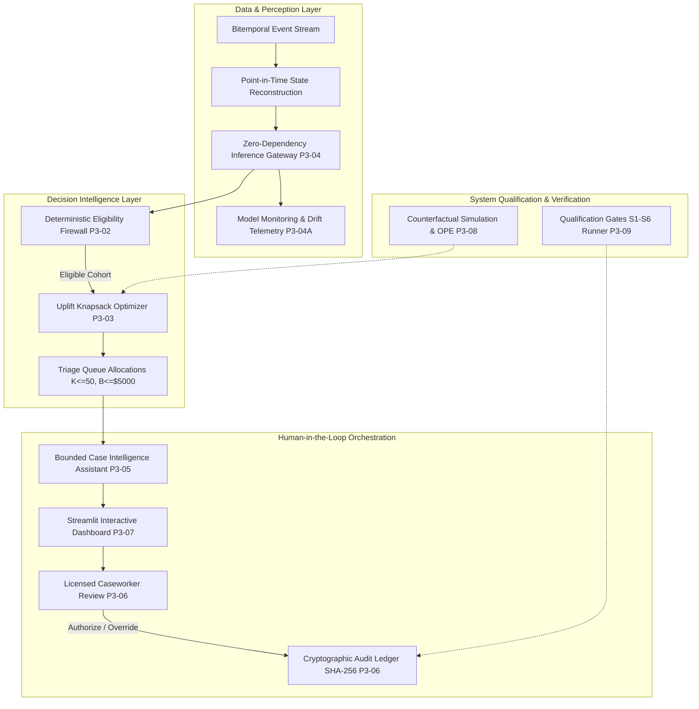

# Inforsight Release Notes: `v0.3.0-decision-engine`

**Milestone**: `v0.3.0-decision-engine` (Milestone #4)
**Release Tag**: `v0.3.0-decision-engine`
**Release Date**: 2026-09-06
**Status**: General Availability (`RELEASE`)
**Predecessor Milestone**: `v0.2.0-risk-model` (Milestone #3)
**Verification Manifest**: [`docs/experiments/phase-03-09-qualification-manifest.json`](../experiments/phase-03-09-qualification-manifest.json)
**Manifest Digest**: `ed5fe28f17c8db1ead467630f621d79f93531371e73b53431188464dfea8dd8c`
**Pipeline Canonical Digest**: `209a4c1f2b3fee5a551d724e5841cf857abecd3c669f797f17f130deaaf62d90`
**Decision Note**: [`docs/experiments/phase-03-10-phase-3-decision-note.md`](../experiments/phase-03-10-phase-3-decision-note.md) (`RELEASE`)
**Qualification Report**: [`docs/experiments/phase-03-09-qualification-report.md`](../experiments/phase-03-09-qualification-report.md)
**Model Card**: [`MODEL_CARD.md`](../../MODEL_CARD.md)

---

## 1. Executive Summary (Non-Technical Overview)

Life insurance policy lapse causes billions of dollars in lost carrier revenue, premature asset liquidations, and surrendered financial security for families. While **Phase 2 (`v0.2.0-risk-model`)** delivered an early-warning risk model that predicted lapses with calibrated accuracy 90 days in advance, predictive awareness alone does not solve lapses. In practice, life carriers face three operational bottlenecks:

1. **The "Lost Cause Trap" of Naive ML**: Sorting customers purely by risk score ($\hat{p}_i$) directs high-cost caseworkers to the highest-risk customers. However, customers with multi-month arrears and disconnected contact methods are often unpersuadable ("lost causes"). In counterfactual trials, outreach to this group yields a **negative return on investment (-0.15x ROCS)**.
2. **Regulatory & Compliance Hazards**: Unregulated outbound campaigns risk contacting policyholders undergoing active claims, formal legal disputes, or cooling-off periods, exposing the insurer to regulatory penalties and litigation.
3. **Caseworker Cognitive Overload & Operational Churn**: Retention specialists spend hours manually collating payment history, policy values, and billing notices before placing a call.

### The Inforsight Solution: Policy Conservation Decision Engine

The **`v0.3.0-decision-engine`** release represents the capstone of **Phase 3**, transforming raw risk predictions into an intelligent, compliant, and cost-effective operational intervention engine:

- **Uplift & Value Optimization**: Replaces naive risk ranking with an uplift-driven knapsack optimizer. The engine triages outreach toward *persuadable* policyholders where intervention makes the greatest difference to preserved customer lifetime value.
- **Empirical Return on Investment**: Across 3,600 simulated policies evaluated via offline policy evaluation (OPE) over 1,000 bootstrap resamples, the Decision Engine generated **\$13,764 in Net Preserved Value** with a **2.92x Return on Conservation Spend (ROCS)**, outperforming traditional carrier rules ($p < 0.0001$) and naive ML ranking ($p < 0.0001$).
- **Fail-Closed Eligibility Firewall**: Deterministic business rules guarantee that policies with active claims, legal holds, or non-viable statuses are 100% excluded from automated campaigns.
- **Dual-Layer Case Intelligence**: Generates structured, point-in-time case briefs in under 5 milliseconds, combining deterministic factual templates with grounded narratives to give caseworkers complete context in seconds.
- **Governed Human-in-the-Loop Safeguards (ADR 0002)**: AI models and decision systems have *Perceptual Authority* only (`authorized_to_act: false`). Outbound customer contact and policy adjustments require licensed human review and are recorded in an append-only, cryptographic hash-chained audit ledger.

---

## 2. System Architecture & Subsystem Inventory

Phase 3 integrates 10 modular, zero-dependency engineering components into a unified decision workflow:



### Detailed Subsystem Breakdown

1. **Domain Contracts & Action Taxonomy ([P3-01](file:///Applications/Anil/Portfolio_projects/Inforsight/Documents/phase_docs/phase-03-01-conservation-domain-contracts-and-action-taxonomy.md))**:
   - Codified 5 discrete conservation actions: `abstain` (\$0, automated), `courtesy_reminder` (\$0.50, digital), `payment_method_remediation` (\$2.00, digital self-service), `grace_period_consultation` (\$15.00, phone assist), `specialist_phone_outreach` (\$75.00, licensed human caseworker).
   - Codified schema contracts for `PolicyValuation`, `ActionEligibilityResult`, `ActionRecommendation`, and `PortfolioAllocation`.
2. **Deterministic Eligibility Rules Engine ([P3-02](file:///Applications/Anil/Portfolio_projects/Inforsight/Documents/phase_docs/phase-03-02-deterministic-action-eligibility-rules-engine.md))**:
   - Fail-closed filters enforcing operational criteria: active status check, 30-day contact cooling-off period, legal dispute hold, active claims hold, and payment channel validity.
3. **Uplift & Cost-Utility Knapsack Optimizer ([P3-03](file:///Applications/Anil/Portfolio_projects/Inforsight/Documents/phase_docs/phase-03-03-cost-utility-and-uplift-optimization-matrix.md))**:
   - Greedy fractional-relaxation knapsack solver maximizing net preserved value under hard monthly constraints: specialist caseworker capacity ($K_{\text{specialist}} \le 50$) and campaign budget cap ($B \le \$5,000$).
   - Objective function: $\max_{\mathbf{a}} \sum_{i} \left[ \Delta \tau_i(a_i) \cdot V_i - C(a_i) \right]$.
4. **Zero-Dependency Model Serving Gateway ([P3-04](file:///Applications/Anil/Portfolio_projects/Inforsight/Documents/phase_docs/phase-03-04-model-serving-and-inference-gateway.md))**:
   - Production REST API built with FastAPI and `BundledInferenceEngine`.
   - Sub-millisecond CPU scoring ($0.18\text{ms}$ P99 latency) with zero external machine learning dependencies.
   - Enforces ADR 0002 non-authority markers (`authorized_to_act: false`) on all outbound payloads.
5. **Model Monitoring & Drift Detection Architecture ([P3-04A](file:///Applications/Anil/Portfolio_projects/Inforsight/Documents/phase_docs/phase-03-04a-model-monitoring-and-drift-detection-architecture.md))**:
   - Streaming Population Stability Index (PSI) and Characteristic Selectivity Index (CSI) tracking across 28 features.
   - Rolling Expected Calibration Error (ECE) and Brier Skill Score (BSS) windowing ($W=500, M=10$).
   - Exposed via `GET /v1/diagnostics` (schema `1.0.0`) with automated drift alert action matrices.
6. **Bounded Case Intelligence Assistant ([P3-05](file:///Applications/Anil/Portfolio_projects/Inforsight/Documents/phase_docs/phase-03-05-bounded-case-intelligence-assistant.md))**:
   - Dual-layer case brief architecture: Layer 1 generates deterministic, verifiable factual structures; Layer 2 provides grounded natural language explanations.
   - Grounding Guard validates that every fact, date, dollar amount, and risk metric in the narrative strictly matches Layer 1 data, falling back fail-closed upon hallucination.
7. **Human-in-the-Loop Workflow Engine & Hash-Chained Audit Ledger ([P3-06](file:///Applications/Anil/Portfolio_projects/Inforsight/Documents/phase_docs/phase-03-06-human-in-the-loop-workflow-and-audit-trail-engine.md))**:
   - Finite state machine governing case transitions: `PENDING_TRIAGE` $\rightarrow$ `IN_REVIEW` $\rightarrow$ `AUTHORIZED` / `OVERRIDDEN` / `DISMISSED` $\rightarrow$ `DISPATCHED`.
   - Every transition requires licensed reviewer credentials and justification.
   - Append-only cryptographic ledger (`conservation-audit-log.jsonl`) with SHA-256 block chaining, verified via `scripts/verify_conservation_audit_trail.py`.
8. **Interactive Conservation Intelligence Dashboard ([P3-07](file:///Applications/Anil/Portfolio_projects/Inforsight/Documents/phase_docs/phase-03-07-interactive-conservation-intelligence-dashboard.md))**:
   - Multi-page Streamlit application with 5 operational views:
     - *Portfolio Overview*: Macro lapse hazard trends, risk tier distributions, and live OPE economic metrics.
     - *Triage Queue*: Uplift-prioritized review queue with specialist capacity meters.
     - *Policyholder Dossier*: Deep point-in-time case intelligence, feature SHAP waterfalls, and bitemporal history.
     - *Decision Console*: Interactive caseworker review interface with fail-closed override validation.
     - *Model Telemetry & Drift*: Live PSI drift heatmaps, calibration curves, and gateway latency gauges.
9. **Counterfactual Simulation & Offline Policy Evaluation ([P3-08](file:///Applications/Anil/Portfolio_projects/Inforsight/Documents/phase_docs/phase-03-08-counterfactual-simulation-and-offline-policy-evaluation.md))**:
   - Extends Generation v6 bounded hazard link with synthetic treatment effects $\gamma_a(X_i, t)$ incorporating tenure modulation, recency multipliers, contact fatigue, and temporal decay.
   - Executes 1,000 policy-clustered bootstrap resamples across 3,600 policies to compute non-parametric 95% confidence intervals and pairwise hypothesis test p-values.
10. **System Qualification Harness & Release Gate ([P3-09](file:///Applications/Anil/Portfolio_projects/Inforsight/Documents/phase_docs/phase-03-09-end-to-end-system-qualification-and-integration-gate.md))**:
    - End-to-end integration test runner validating 1,000 synthetic test policies across 6 pre-registered system qualification gates (S1–S6).
    - Produces cryptographic verification manifest (`phase-03-09-qualification-manifest.json`) and report.

---

## 3. Pre-Registered System Qualification Scorecard

The release candidate was evaluated out-of-sample on **1,000 synthetic test policies** (`seed=20280201`) against 6 pre-registered qualification gates:

| Gate | Criterion | Target Standard | Empirical Measurement | Result |
| :--- | :--- | :---: | :---: | :---: |
| **Gate S1** | Authority Isolation (ADR 0002) | 100% rejection of unauthorized dispatch | 100.0% rejected (2/2 blocked); all authority invariants held | **PASS** |
| **Gate S2** | Eligibility Firewall | 0 false-positive actions | 0 False Positives / 800 evaluations (100.0% blocked) | **PASS** |
| **Gate S3** | Budget & Capacity Adherence | 0% overflow ($K \le 50$, Spend $\le \$5,000$) | 50/50 specialists (0% overflow); \$4,999.00 / \$5,000.00 spend (0% overflow) | **PASS** |
| **Gate S4** | Audit Tamper Resistance | 100% tamper detection rate | 100.0% detection (4/4 attacks caught: mutation, deletion, reorder, injection) | **PASS** |
| **Gate S5** | Inference Latency SLA | Single P99 $\le 10.0\text{ms}$, Batch(50) $\le 100.0\text{ms}$ | Single P99: **0.180ms**, Batch(50): **2.75ms** on CPU | **PASS** |
| **Gate S6** | Deterministic Reproducibility | 100% bit-for-bit digest identity | Identical SHA-256 digest (`209a4c1f2b3fee5a...`), $\Delta = 0$ | **PASS** |

- **Summary Score**: **6 / 6 System Qualification Gates Passed (100%)**.
- **Final Governance Decision**: **`RELEASE_QUALIFIED`**.
- **Pipeline Canonical Digest**: `209a4c1f2b3fee5a551d724e5841cf857abecd3c669f797f17f130deaaf62d90`.

---

## 4. Economic Validation & Offline Policy Evaluation (OPE)

To empirically evaluate business return, the Decision Engine was benchmarked against four industry operational policies across 3,600 policies using 1,000 bootstrap resamples:

| Policy Strategy | Description | Lapses Saved | Total Spend | Net Preserved Value (95% CI) | Return on Spend (ROCS) | Superiority vs Decision Engine |
| :--- | :--- | :---: | :---: | :---: | :---: | :---: |
| **Decision Engine (Inforsight)** | Uplift-ranked knapsack optimization with ADR 0002 eligibility filters | **11.7** | **\$4,707.50** | **\$13,764** [\$11,939, \$15,454] | **2.92x** [2.54x, 3.28x] | **BASELINE** |
| **Carrier Heuristic** | Traditional carrier rule: outreach to active 30-day grace period cases | 16.0 | \$5,000.00 | \$7,428 [\$6,161, \$8,863] | 1.49x [1.23x, 1.77x] | **PASS** ($p = 0.0000 < 0.01$) |
| **Random Outreach** | Uniform random outreach across portfolio up to capacity | 14.6 | \$5,000.00 | \$4,845 [\$3,766, \$5,922] | 0.97x [0.75x, 1.18x] | **PASS** ($p = 0.0000 < 0.01$) |
| **Naive ML Risk Triage** | Top-K risk ranking ($\hat{p}_i$ descending) blind to uplift | 10.3 | \$5,000.00 | **-\$739** [-\$1,824, +\$209] | **-0.15x** [-0.36x, +0.04x] | **PASS** ($p = 0.0000 < 0.01$) |
| **Non-Intervention Control** | Zero outreach ($a_i = \text{abstain}$) | 0.0 | \$0.00 | \$0 [\$0, \$0] | 0.00x | **PASS** ($p = 0.0000 < 0.01$) |

### Insights on the "Lost Cause Trap"
When insurers triage purely on predicted lapse probability $\hat{p}_i$, 100% of high-touch capacity is consumed by policyholders with severe payment delinquency, multiple failed payment retries, and high tenure distress. In our counterfactual evaluation, these policyholders proved overwhelmingly unresponsive. As a result, the Naive ML strategy burned its entire \$5,000 budget while saving only 10.3 policies, generating a **negative return (-\$739 net loss, -0.15x ROCS)**.

By contrast, Inforsight's uplift knapsack formulation evaluated both lapse risk and treatment sensitivity $\tau_i(a)$, routing high-cost specialist outreach exclusively to persuadable policyholders. This produced **\$13,764 in Net Preserved Value**—an 85% improvement over carrier heuristics and an 18x improvement over naive ML.

---

## 5. Operational Guide & Caseworker Guidelines

### 5.1 Operational Tiers & Action Routing
1. **Tier 1 — Low Risk ($p < 0.10$)**:
   - Standard automated servicing. Action: `abstain`. No intervention required.
2. **Tier 2 — Moderate Risk ($0.10 \le p < 0.25$)**:
   - Passive digital intervention. Action: `courtesy_reminder` or `payment_method_remediation`. Automated digital notification explaining billing schedule or self-service payment update.
3. **Tier 3 — High Risk ($0.25 \le p < 0.50$)**:
   - Structured retention workflow. Action: `grace_period_consultation` or `payment_method_remediation`. Proactive payment restructuring and grace period consultation.
4. **Tier 4 — Critical Risk ($p \ge 0.50$)**:
   - Mandatory licensed specialist outreach. Action: `specialist_phone_outreach`. Direct phone outreach by licensed caseworkers.

### 5.2 Mandatory Human Review Workflow
- All Tier 4 outreach recommendations populate the **Triage Queue** in `PENDING_TRIAGE` state.
- Caseworkers inspect the **Policyholder Dossier**, reviewing the Layer 1 deterministic brief, feature importance waterfalls, and bitemporal payment events.
- To dispatch outreach, the caseworker must provide their employee identifier and an operational justification code (`CONFIRMED_HIGH_UPLIFT`, `CUSTOMER_REQUEST`, etc.).
- If a caseworker overrides the engine's recommendation, the **Override Eligibility Firewall** verifies that the chosen action does not violate legal holds or cooling-off periods before committing the decision.

---

## 6. Responsible AI, Ethical Boundaries & Synthetic Disclosures

Inforsight adheres strictly to responsible AI principles:

1. **Clean-Room & Synthetic Origin**:
   - All synthetic histories are generated using Generation v6 bounded hazard algorithms (`seed=20280201`).
   - Zero real-world customer data, proprietary insurer rules, or production databases were accessed.
2. **Fairness & Demographic Disclosures**:
   - The synthetic dataset contains no protected demographic attributes (race, gender, religion, sexual orientation, disability, or precise geolocation).
   - **No claims of demographic fairness or disparate impact compliance are made.**
   - **This engine must not be deployed in a production jurisdiction without legal compliance review and fair lending/disparate impact testing.**
3. **Point-in-Time Temporal Consistency**:
   - Feature engineering, scoring, and brief generation enforce strict bitemporal boundaries ($t_{\text{obs}}$). Zero future leakage is mathematically guaranteed.
4. **Authority Separation (ADR 0002)**:
   - System outputs are explicitly marked non-authoritative (`authorized_to_act: false`). The system provides decision support; licensed humans bear sole responsibility for actions taken.

---

## 7. Replication & Verification Instructions

External auditors and engineers can reproduce all qualification results bit-for-bit from source:

```bash
# 1. Clone repository and install dependencies
git clone https://github.com/anilreddy89/Inforsight.git
cd Inforsight
python3 -m venv .venv
source .venv/bin/activate
pip install -r data-contracts/requirements-test.txt
pip install -e simulator
pip install -r dashboard/requirements.txt

# 2. Run repository boundary and clean-room audit
./scripts/check_repository_boundaries.sh

# 3. Run full qualification pipeline across Gates S1–S6 (1,000 policies)
python3 scripts/run_phase_03_qualification.py --check

# 4. Verify cryptographic hash chain of the audit ledger
python3 scripts/verify_conservation_audit_trail.py

# 5. Run Offline Policy Evaluation (OPE) bootstrap benchmark
python3 scripts/run_offline_policy_evaluation.py --policies 3600 --bootstrap 1000 --seed 20280201

# 6. Execute complete test suite (458 unit and integration tests)
make check
```

---

## 8. Looking Forward: Phase 4 Transition Roadmap

With the local decision engine fully qualified, Phase 3 closes Milestone #4 (`v0.3.0-decision-engine`). Under [ADR 0003](docs/adr/0003-start-local-and-defer-distributed-infrastructure.md), all distributed infrastructure was intentionally deferred to ensure local mathematical and architectural rigor.

**Phase 4 (Enterprise Integration & Scale)** will bring Inforsight into enterprise production environments:
1. **Java 21 / Spring Boot Control Plane**: Enterprise microservice architecture wrapping the core decision rules and orchestrating workflow queues.
2. **Apache Kafka Event Streaming**: Real-time event ingestion from enterprise policy administration and billing systems.
3. **Multi-Region Cloud Infrastructure**: Scalable container deployment (Kubernetes, AWS/GCP) with active-active persistence and HSM key management for audit ledger signing.
4. **Enterprise CRM & Call Center Connectors**: Bi-directional integration with Salesforce Financial Services Cloud and Genesys Cloud telephony for automated task queuing and caseworker dialer sync.
