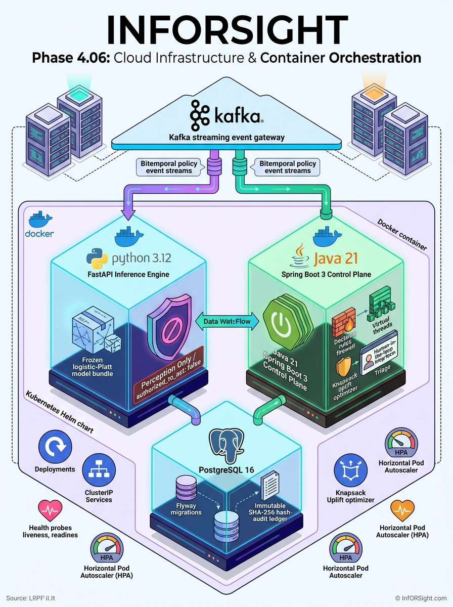

# Infrastructure

Infrastructure starts local and grows only to satisfy demonstrated needs. Cloud resources must be reproducible, observable, tagged, budget-controlled, and removable. No cloud infrastructure is provisioned by the Phase 0 scaffold.

---

## Architecture Overview



### Polyglot Service Matrix

| Service | Technology & Image | Ports | Health Probe | Authority Boundary (ADR 0002) |
| :--- | :--- | :--- | :--- | :--- |
| **Streaming Gateway** | `confluentinc/cp-kafka:7.6.0` (KRaft mode) | `9092` (host)<br>`29092` (internal) | `kafka-broker-api-versions --bootstrap-server localhost:9092` | Event ingestion & bitemporal streams |
| **Inference Engine** | Python 3.12 / FastAPI (`infra/docker/Dockerfile.inference`) | `8000` | `GET /health` | **Perception Only**: `authorized_to_act: false`, zero DB access |
| **Control Plane** | Java 21 / Spring Boot 3 (`infra/docker/Dockerfile.control-plane`) | `8080` | `GET /actuator/health` | **Sole Action Authority**: Rules firewall, knapsack solver, HITL triage |
| **Persistence & Audit** | `postgres:16-alpine` (Flyway migrations) | `5432` (internal)<br>`5433` (host) | `pg_isready -U inforsight_app -d inforsight_enterprise` | Immutable append-only SHA-256 hash-chained audit ledger |

---

## Runnable Local Evidence Artifacts

P4-06 provides runnable local evidence artifacts:

- `docker-compose.yml` starts the bounded Kafka, PostgreSQL, inference, and
  Java control-plane topology with health checks. Its credentials are local
  development values only.
- `docker/Dockerfile.control-plane` builds the Spring Boot service through a
  Maven builder stage and runs the JRE image as a non-root user.
- `docker/Dockerfile.inference` builds the bounded HTTP inference runtime
  through a Python builder stage and runs it as a non-root user.
- `helm/inforsight` renders the control-plane, inference, PostgreSQL, service,
  probe, resource, and HPA configuration. It is a deployment configuration
  baseline, not proof of a live cluster, cloud readiness, or production SLO.

## Validation & Local Commands

Run the static gate with `make p4-06-check`. If Docker is available, validate
the Compose file with `docker compose -f infra/docker-compose.yml config` and
build the images from the repository root.

1. **Static Validation Gate (No Docker required):**
   ```bash
   make p4-06-check
   ```

2. **Start Local Topology:**
   ```bash
   docker compose -f infra/docker-compose.yml up --build -d
   ```

3. **Verify Health Endpoints:**
   ```bash
   # Inference health probe
   curl -s http://localhost:8000/health

   # Control Plane actuator health probe
   curl -s http://localhost:8080/actuator/health
   ```

4. **Tear Down Local Stack:**
   ```bash
   docker compose -f infra/docker-compose.yml down -v
   ```

For detailed specifications, architectural trade-offs, and boundary definitions, see the [Phase 4.06 Documentation](../Documents/phase_docs/phase-04-06-cloud-infrastructure-helm-and-orchestration.md).
